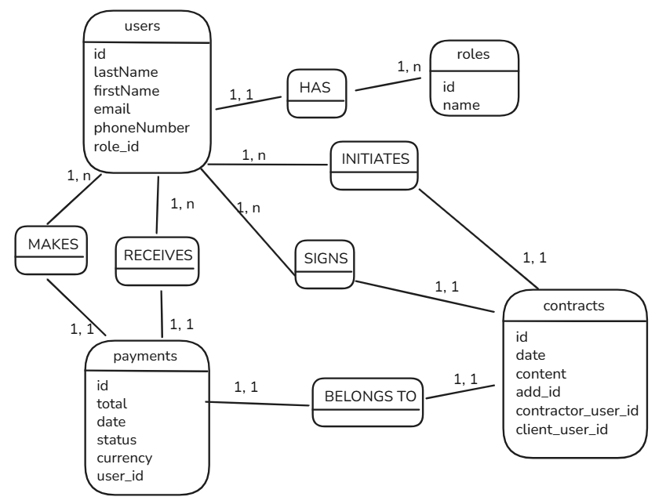

## Membres du groupe

Nom/prénom : Saint-Marc Maimiti
Nom/prénom : Sbaffe Claire

---

### 1. Présentation du Projet

Décrivez votre application en 3-5 phrases : problématique, objectif et fonctionnalités principales.

### 2. Architecture PostgreSQL (Méthode Merise)

**MCD (Modèle Conceptuel de Données)**


**MLD (Modèle Logique de Données)**



OU

```
users(id, lastName, firstName, email, phoneNumber, role_id)
roles(id, name)
payments(id, total, date, status, currency, user_id, user_paid_id)
contracts(id, date, content, listing_id, contractor_user_id, client_user_id)
```

**MPD (Modèle Physique de Données)**

```sql
-- =======================================
-- TABLE: roles
-- =======================================
CREATE TABLE roles (
    id SERIAL PRIMARY KEY,
    name VARCHAR(50) NOT NULL UNIQUE
);

-- =======================================
-- TABLE: users
-- =======================================
CREATE TABLE users (
    id SERIAL PRIMARY KEY,
    last_name VARCHAR(100) NOT NULL,
    first_name VARCHAR(100) NOT NULL,
    email VARCHAR(150) NOT NULL UNIQUE,
    phone_number VARCHAR(20),
    role_id INTEGER NOT NULL,
    CONSTRAINT fk_users_roles FOREIGN KEY (role_id)
        REFERENCES roles(id)
        ON UPDATE CASCADE
        ON DELETE RESTRICT
);

-- =======================================
-- TABLE: payments
-- =======================================
CREATE TABLE payments (
    id SERIAL PRIMARY KEY,
    total NUMERIC(10,2) NOT NULL,
    date TIMESTAMP DEFAULT CURRENT_TIMESTAMP,
    status VARCHAR(30) CHECK (status IN ('pending', 'completed', 'failed')),
    currency VARCHAR(10) DEFAULT 'EUR',
    user_id INTEGER NOT NULL,
    CONSTRAINT fk_payments_users FOREIGN KEY (user_id)
        REFERENCES users(id)
        ON UPDATE CASCADE
        ON DELETE CASCADE
);

-- =======================================
-- TABLE: contracts
-- =======================================
CREATE TABLE contracts (
    id SERIAL PRIMARY KEY,
    date TIMESTAMP DEFAULT CURRENT_TIMESTAMP,
    content TEXT,
    ad_id TEXT,
    contractor_user_id INTEGER NOT NULL,
    client_user_id INTEGER NOT NULL,
    CONSTRAINT fk_contracts_contractor FOREIGN KEY (contractor_user_id)
        REFERENCES users(id)
        ON UPDATE CASCADE
        ON DELETE RESTRICT,
    CONSTRAINT fk_contracts_client FOREIGN KEY (client_user_id)
        REFERENCES users(id)
        ON UPDATE CASCADE
        ON DELETE RESTRICT
);

```

### 3. Architecture MongoDB

```js
// ========================================
// COLLECTION: ads
// ========================================
db.ads.insertMany([
  {
    _id: ObjectId("651a1fabc9a1d9337a123456"),
    userId: 3, // ref to PostgreSQL data
    title: "Appartement T3 centre-ville",
    description:
      "Charmant T3 situé en plein cœur de Bordeaux, idéal pour les familles ou les couples.",
    address: {
      country: "France",
      postcode: "33000",
      city: "Bordeaux",
      street: "1 rue du Truc",
      addressSupplement: "",
    },
    price: 219.99,
    currency: "EUR",
    specifications: {
      type: "home", // room or home
      offers: ["wifi", "kitchen", "fridge", "washing machine", "TV"],
      images: [
        "https://example.com/images/appartement-t3-1.jpg",
        "https://example.com/images/appartement-t3-2.jpg",
        "https://example.com/images/appartement-t3-3.jpg",
      ],
    },
    selfCheckin: true,
    rating: {
      average: 4.5,
      count: 2,
    },
    createdAt: new Date("2024-01-15"),
    updatedAt: new Date("2024-01-16"),
  },
]);

// ========================================
// COLLECTION: comments
// ========================================
db.comments.insertMany([
  {
    userId: 6, // ref to PostgreSQL data
    adId: ObjectId("651a1fabc9a1d9337a123456"),
    comment:
      "Super séjour à Bordeaux ! L’appartement était propre et bien situé, hôte très réactif.",
    rating: 4.5,
    date: new Date("2024-09-24"),
  },
]);

// ========================================
// COLLECTION: ratings
// ========================================
db.ratings.insertMany([
  {
    userId: 5, // ref to PostgreSQL data
    adId: ObjectId("651a1fabc9a1d9337a123456"),
    rating: 4.5,
    date: new Date("2024-09-26"),
  },
]);
```

### 4. Justification des Choix Techniques

- **Répartition des données** : Quelles données en PostgreSQL ? Quelles données en MongoDB ? Pourquoi ?
- **Modélisation MongoDB** : Documents imbriqués ou références ? Justification
- **Relations inter-bases** : Comment les deux bases communiquent-elles ?

### 5. Exemples de Requêtes Complexes

**PostgreSQL**

```sql
-- Exemple de requête avec jointure et agrégat
```

**MongoDB**

```javascript
const searchAds = async (offersCriteria, maxPrice) => {
  const client = new MongoClient(mongoUri);
  try {
    await client.connect();
    const db = client.db(dbName);

    let query = [];

    if (maxPrice) {
      query.push({ $match: { price: { $lt: Number(maxPrice) } } });
    }

    if (offersCriteria && offersCriteria.length > 0) {
      query.push({
        $match: { "specifications.offers": { $all: offersCriteria } },
      });
    }

    const ads = await db.collection("ads").aggregate(query).toArray();

    return ads;
  } finally {
    await client.close();
  }
};
```

### 6. Stratégie de Sauvegarde

Pour cette partie, vous devez effectuer des recherches afin d'argumenter vos réponses.

- **PostgreSQL** : Méthode proposée (pg_dump, sauvegarde continue, etc.)
- **MongoDB** : Méthode proposée (mongodump, replica set, etc.)
- **Fréquence** : Complète, incrémentale, différentielle
- **Restauration** : Procédure en cas de perte de données
